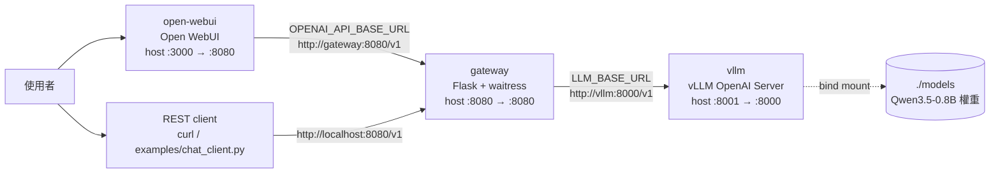

# vLLM-Demo — Qwen3.5-0.8B 本機推論堆疊

以 Docker Compose 一鍵拉起的本機大語言模型服務:**vLLM** 負責推論、**Flask gateway** 提供可觀測、可重試的 OpenAI 相容介面、**Open WebUI** 提供瀏覽器聊天介面。

[](https://github.com/chaworld/vLLM-Demo/actions/workflows/ci.yml)


## 這是什麼

一套可以整組複製走的「本機 LLM 服務範本」。`docker compose up -d` 之後,你會得到三個互相串好的服務,以及一個和 OpenAI SDK 相容的 `/v1` 端點。

**為什麼中間要多一層 gateway?** 直接把 vLLM 端點對外開放也能用,但少了維運需要的東西。這層 Flask + waitress 代理補上:

- **健康探針分層** — `/healthz` 只確認 gateway 行程存活(不觸碰上游),`/readyz` 會實打上游 `/models` 確認整條推論鏈可用。兩者語義不同,才能讓 compose 的 `depends_on: service_healthy` 與外部監控各取所需。
- **逾時與重試** — 連線/讀取逾時分開設定(`LLM_CONNECT_TIMEOUT` / `LLM_READ_TIMEOUT`),並對 429/500/502/503/504 做指數退避重試,避免上游暖機期間的瞬斷直接變成使用者錯誤。
- **執行期指標** — `/metrics` 輸出請求量、失敗數、延遲 p50/p95/max 與累計 prompt/completion token,不必額外接 Prometheus 就能看到基本水位。
- **結構化日誌** — 每筆請求配發 `request_id` 並回寫到 `X-Request-ID` 標頭,以 JSON Lines 落地到 `logs/gateway/`,可用同一個 ID 串起 gateway 與容器日誌。
- **回應正規化** — 統一相容 `max_tokens` / `max_completion_tokens` 兩種欄位、把上游的一次性回應包裝成 OpenAI 格式的 SSE 串流,並在伺服器端固定關閉 thinking、清除殘留的推理內容,前端拿到的永遠是乾淨的最終答案。

## 架構



三個服務都在同一個 compose 網路內,彼此用**服務名 + 容器內埠**溝通(例如 `http://vllm:8000/v1`);`VLLM_PORT` / `GATEWAY_PORT` / `OPEN_WEBUI_PORT` 只影響宿主機對外映射的埠。

| 服務 | 角色 | 宿主機預設網址 |
|---|---|---|
| `open-webui` | 瀏覽器聊天介面 | <http://localhost:3000> |
| `gateway` | OpenAI 相容代理層 | <http://localhost:8080/v1> |
| `vllm` | 推論引擎原始端點 | <http://localhost:8001/v1> |

## 系統需求

| 項目 | 需求 |
|---|---|
| **共通** | Docker Engine 24+ 或 Docker Desktop(含 Compose v2);約 15 GB 磁碟空間(vLLM 映像較大)+ 約 1.7 GB 模型權重;可連外網路 |
| **GPU 版**<br>`docker-compose.gpu.yml` | NVIDIA GPU 與對應驅動。**Linux 原生主機必須先安裝 [NVIDIA Container Toolkit](https://docs.nvidia.com/datacenter/cloud-native/container-toolkit/latest/install-guide.html)**,否則 compose 的 `devices: driver: nvidia` 保留區塊會失敗;Windows 11 + Docker Desktop(WSL2 後端)已內建 GPU 直通,不需另外安裝。顯存需求視參數而定,4 GB 等小顯存卡需調參(見[小顯存調參](#小顯存調參)) |
| **CPU 版**<br>`docker-compose.cpu.yml` | x86_64 主機保持 `VLLM_CPU_IMAGE_TAG=latest-x86_64`,macOS Apple Silicon 等 ARM 主機改為 `latest-arm64`;建議 8 GB 以上可用記憶體(`VLLM_MEMORY_LIMIT` 預設 `8g`)。純 CPU 推論明顯較慢,compose 已把 `start_period` 放寬到 180 秒、`LLM_READ_TIMEOUT` 放寬到 300 秒 |
| **開發(選用)** | Python 3.12,僅在宿主機跑測試或直接執行 gateway 時需要 |

## 快速開始

### 1. 取得原始碼並建立 `.env`

所有可調參數都集中在 `.env`,compose 會自動載入同目錄的這個檔案。

```bash
git clone https://github.com/chaworld/vLLM-Demo.git
cd vLLM-Demo
cp .env.example .env                      # Windows PowerShell: Copy-Item .env.example .env
```

### 2. 下載模型權重

**模型權重不在 git 內**(`models/` 已列入 `.gitignore`,約 1.7 GB),clone 下來的目錄是空的。以下腳本會用一次性容器把權重抓進 `./models`,宿主機不需要安裝 Python 或 `huggingface_hub`:

```bash
bash scripts/download_model.sh            # Linux / macOS
```

```powershell
pwsh -File scripts/download_model.ps1     # Windows PowerShell
```

> vLLM 首次啟動時也會自動下載同一份權重,所以這步嚴格說是**選用**的;但先下載可以把「拉權重」與「起服務」兩件事分開,失敗時比較好判斷是哪一段出問題。
> 只有**私有或受管制**的權重需要先在 `.env` 設 `HUGGING_FACE_HUB_TOKEN`,公開權重留空即可。

### 3. 啟動堆疊(擇一)

```bash
# 路徑 A:有 NVIDIA GPU
docker compose -f docker-compose.gpu.yml up -d --build

# 路徑 B:純 CPU(Apple Silicon 等 ARM 主機請先在 .env 設 VLLM_CPU_IMAGE_TAG=latest-arm64)
docker compose -f docker-compose.cpu.yml up -d --build
```

兩份 compose 的服務名完全相同,後續指令只需替換 `-f` 後面的檔名(以下一律以 GPU 版示範)。

### 4. 等待並驗證健康狀態

vLLM 冷啟動(載入權重、編譯 kernel)需要數分鐘,GPU 版 healthcheck 給了 120 秒暖機、CPU 版 180 秒。

```bash
docker compose -f docker-compose.gpu.yml ps             # 三個服務是否都是 healthy
docker compose -f docker-compose.gpu.yml logs -f vllm   # 觀察下載 / 暖機進度

curl http://localhost:8080/healthz    # {"service":"qwen35-gateway","status":"ok"}
curl http://localhost:8080/readyz     # {"status":"ready","upstream_models":["qwen3.5-0.8b"]}
```

```powershell
# Windows PowerShell 若無 curl 別名,改用:
Invoke-RestMethod http://localhost:8080/healthz
Invoke-RestMethod http://localhost:8080/readyz
```

`/readyz` 回 200 代表 gateway → vLLM 這條鏈路已通。

### 5. 開始使用 / 停止

瀏覽器開啟 <http://localhost:3000>,模型選單會出現 `qwen3.5-0.8b`。

```bash
docker compose -f docker-compose.gpu.yml down       # 停止,保留對話記錄與權重
docker compose -f docker-compose.gpu.yml down -v    # 一併清掉 Open WebUI 的資料 volume
```

## 使用方式

### Open WebUI

<http://localhost:3000>。預設 `WEBUI_AUTH=false`(免登入,適合本機試用);要開啟帳號機制就在 `.env` 設為 `true`,並在**尚未建立任何使用者前**啟動。

### curl 呼叫 `/v1/chat/completions`

```bash
curl http://localhost:8080/v1/chat/completions \
  -H 'Content-Type: application/json' \
  -d '{
    "model": "qwen3.5-0.8b",
    "messages": [
      {"role": "system", "content": "你是一個以繁體中文回答的助理。"},
      {"role": "user", "content": "用一句話說明什麼是向量資料庫。"}
    ],
    "temperature": 0.3,
    "max_tokens": 256
  }'
```

串流(SSE)形式只要加上 `"stream": true`:

```bash
curl -N http://localhost:8080/v1/chat/completions \
  -H 'Content-Type: application/json' \
  -d '{"model":"qwen3.5-0.8b","messages":[{"role":"user","content":"說「你好」兩個字"}],"stream":true,"max_tokens":32}'
```

完整的分段範例腳本(健康檢查 → 模型清單 → 對話 → 串流 → 指標 → 直連 vLLM):

```bash
bash examples/rest_api_examples.sh http://localhost:8080 http://localhost:8001   # Linux / macOS / Git Bash
```

```powershell
pwsh -File examples/rest_api_examples.ps1 -VllmUrl http://localhost:8001         # Windows
```

> 兩個腳本的 vLLM 預設網址是 `:8000`,而 `.env.example` 把 `VLLM_PORT` 設為 `8001`,所以要測「直連 vLLM」那段時請如上明確帶入埠號。

### Python 範例客戶端

`examples/chat_client.py` 只依賴 `requests`,支援單次提問、多輪互動與自我測試三種模式:

```bash
pip install requests
python examples/chat_client.py --prompt "台灣最高的山是哪一座?"
python examples/chat_client.py --interactive        # 多輪對話,輸入 /reset 清空、/quit 離開
python examples/chat_client.py --self-test          # 檢查模型清單、基本問答、thinking 是否關閉
python examples/chat_client.py --base-url http://localhost:8001/v1 --prompt "hi"   # 直連 vLLM
```

其他可用參數:`--model`、`--api-key`、`--temperature`、`--max-tokens`、`--verbose`;也可用環境變數 `CHAT_BASE_URL`、`CHAT_MODEL`、`CHAT_API_KEY` 覆寫預設值。

### 用 OpenAI SDK

gateway 是標準 OpenAI 相容端點,任何 OpenAI SDK 把 base URL 指過來即可(`api_key` 不被驗證):

```python
from openai import OpenAI
client = OpenAI(base_url="http://localhost:8080/v1", api_key="EMPTY")
r = client.chat.completions.create(model="qwen3.5-0.8b", messages=[{"role": "user", "content": "你好"}])
print(r.choices[0].message.content)
```

## API 參考

Base URL:`http://localhost:8080`(可用 `GATEWAY_PORT` 調整)。gateway **沒有內建認證**,`Authorization` 標頭會被接受但不驗證,請勿直接暴露到公網。

| 方法 | 路徑 | 用途 | 回應要點 |
|---|---|---|---|
| `GET` | `/healthz` | 存活檢查;只確認 gateway 行程本身,不觸碰上游 | 恆 `200`,`{"status":"ok","service":"qwen35-gateway"}` |
| `GET` | `/readyz` | 就緒檢查;實際呼叫上游 `/models` 驗證整條推論鏈 | `200` `{"status":"ready","upstream_models":[...]}`;上游不可用時 `503` `{"status":"unavailable","reason":...}` |
| `GET` | `/metrics` | 行程內累積指標 | `requests_total`、`requests_failed`、`prompt_tokens_total`、`completion_tokens_total`、`latency_ms_p50`、`latency_ms_p95`、`latency_ms_max` |
| `GET` | `/v1/models` | OpenAI 相容模型清單;只透出本堆疊對外的單一模型 | `{"object":"list","data":[{"id":"qwen3.5-0.8b","object":"model",...}]}` |
| `POST` | `/v1/chat/completions` | 對話補全;`"stream": true` 時回傳 `text/event-stream` | 標準 `chat.completion` 物件(含 `choices`、`usage`);串流時為 `chat.completion.chunk` 序列並以 `data: [DONE]` 收尾 |

**請求欄位**:`messages` 為必填且不可為空(否則回 `400`)。會被轉送到上游的取樣參數:`temperature`、`top_p`、`stop`、`seed`、`presence_penalty`、`frequency_penalty`、`n`、`user`;長度限制接受 `max_tokens` 或 `max_completion_tokens`。`model` 與 `stream` 由 gateway 決定,前端傳入的值會被忽略。

**回應標頭**:每個回應都帶 `X-Request-ID`;若請求端自行帶入該標頭,gateway 會沿用同一個值,方便跨系統追蹤。

**錯誤格式**:上游異常統一轉成 OpenAI 風格 `{"error": {"message": ..., "type": "upstream_error", "detail": ...}}`,連線失敗回 `503`、上游非 2xx 回 `502`,不外洩內部堆疊。

## 設定

先 `cp .env.example .env`,再依環境調整。以下為 `.env.example` 的完整內容與預設值。

### `.env.example` 變數一覽(依原檔分組)

| 變數 | 預設值 | 說明 |
|---|---|---|
| **── 模型 ──** | | |
| `MODEL_REPO` | `Qwen/Qwen3.5-0.8B` | 要載入的 HuggingFace repo |
| `MODEL_NAME` | `qwen3.5-0.8b` | 對外公開的模型名稱,三個服務共用 |
| `HUGGING_FACE_HUB_TOKEN` | (空) | 只有私有或受管制的權重需要填 |
| **── 對外埠號 ──** | | |
| `VLLM_PORT` | `8001` | vLLM 映射到宿主機的埠(容器內固定 8000) |
| `GATEWAY_PORT` | `8080` | gateway 對外埠 |
| `OPEN_WEBUI_PORT` | `3000` | Open WebUI 對外埠(容器內為 8080) |
| **── vLLM(GPU 版)──** | | |
| `VLLM_IMAGE_TAG` | `latest` | `vllm/vllm-openai` 映像標籤 |
| `VLLM_GPU_MEMORY_UTILIZATION` | `0.78` | 顯存使用率上限;可用上限取決於**容器內**可見的閒置顯存,不是 `nvidia-smi` 的數字 |
| `VLLM_MAX_MODEL_LEN` | `4096` | 最大上下文長度,直接影響 KV cache 大小 |
| `VLLM_MAX_NUM_SEQS` | `8` | 最大並行序列數 |
| `VLLM_CPU_LIMIT` | `4.0` | vLLM 容器的 CPU 核心數上限 |
| **── vLLM(CPU 版)──** | | |
| `VLLM_CPU_IMAGE_TAG` | `latest-x86_64` | x86_64 用 `latest-x86_64`;Apple Silicon 等 ARM 主機改 `latest-arm64` |
| `VLLM_DTYPE` | `bfloat16` | 舊 CPU 不支援 bf16 時改 `float32`(記憶體約需兩倍) |
| `VLLM_CPU_KVCACHE_SPACE` | `4` | KV cache 可用記憶體(GiB) |
| `VLLM_MEMORY_LIMIT` | `8g` | vLLM 容器記憶體上限 |
| **── Gateway ──** | | |
| `LLM_API_KEY` | `EMPTY` | 送往上游的 Bearer token;vLLM 未啟用認證時保持 `EMPTY` |
| `LLM_MAX_TOKENS` | `1024` | 請求未指定長度時的預設輸出上限(CPU compose 內建 fallback 為 `512`) |
| `LLM_TEMPERATURE` | `0.7` | 請求未指定時的預設取樣溫度 |
| `LLM_READ_TIMEOUT` | `120` | 讀取上游回應的逾時秒數(CPU compose 內建 fallback 為 `300`) |
| `LOG_LEVEL` | `INFO` | gateway 日誌等級 |
| **── Open WebUI ──** | | |
| `OPEN_WEBUI_TAG` | `main` | `ghcr.io/open-webui/open-webui` 映像標籤 |
| `WEBUI_AUTH` | `false` | 是否啟用帳號登入;只在全新安裝、尚無使用者時生效 |
| `WEBUI_OPENAI_BASE_URL` | (空) | 留空即使用 compose 內網的 `http://gateway:8080/v1`;僅在 gateway 改跑於宿主機時才需設為 `http://host.docker.internal:8080/v1` |
| `OPEN_WEBUI_MEMORY_LIMIT` | `2g` | Open WebUI 容器記憶體上限 |
| `OPEN_WEBUI_CPU_LIMIT` | `2.0` | Open WebUI 容器 CPU 核心數上限 |
| **── 測試 ──** | | |
| `SMOKE_TIMEOUT` | `180` | 冒煙測試等待服務回應的逾時秒數(CPU compose 內建 fallback 為 `600`) |

### Gateway 進階變數

以下不在 `.env.example` 內,但 gateway 全部支援,可經 compose 的 `environment:` 注入。**gateway 沒有任何必填設定**,全部項目都有預設值(定義於 `gateway/app/config.py`):

| 變數 | 預設值 | 說明 |
|---|---|---|
| `LLM_BASE_URL` | `http://vllm:8000/v1` | 上游 OpenAI 相容端點(兩份 compose 皆已明確設定) |
| `LLM_MODEL_NAME` | `qwen3.5-0.8b` | gateway 送往上游、並對外宣告的模型名稱 |
| `LLM_CONNECT_TIMEOUT` | `5.0` | 連線上游的逾時秒數 |
| `LLM_MAX_RETRIES` | `2` | 對 429/500/502/503/504 的重試次數(指數退避,factor 0.5) |
| `LOG_DIR` | `/var/log/gateway` | JSON Lines 日誌目錄;不可寫時自動退回只輸出 stdout |
| `LOG_MAX_BYTES` | `10485760` | 單一日誌檔輪替門檻(10 MiB) |
| `LOG_BACKUP_COUNT` | `5` | 保留的輪替檔數量 |
| `GATEWAY_HOST` | `0.0.0.0` | waitress 監聽位址 |
| `GATEWAY_PORT` | `8080` | waitress 監聽埠(容器內) |

### 小顯存調參

參考/實測環境為 **NVIDIA RTX 3050 Laptop(4096 MiB VRAM),Windows 11 + WSL2 + Docker Desktop**;`.env.example` 的預設值即以此為基準,並非硬性需求。顯存更充裕的機器可以往上調。

| 變數 | 小顯存(約 4 GB)建議 | 理由 |
|---|---|---|
| `VLLM_GPU_MEMORY_UTILIZATION` | `0.78` | 該環境實測容器內僅約 3.22 / 4.0 GiB 可見,`0.80` 以上會啟動失敗(`0.85` 需要約 3.4 GiB) |
| `VLLM_MAX_MODEL_LEN` | `4096` | 上下文長度直接決定 KV cache 大小,先砍這個最有效 |
| `VLLM_MAX_NUM_SEQS` | `8` | Qwen3.5-0.8B 為混合注意力架構,每條並行序列會固定佔用一段與長度無關的 recurrent state;vLLM 預設 `128` 條在小顯存上會直接撐爆 |

調參順序建議:先降 `VLLM_MAX_MODEL_LEN`,再降 `VLLM_MAX_NUM_SEQS`,最後才微調 `VLLM_GPU_MEMORY_UTILIZATION`。

## 開發與測試

專案共 **29 個測試**:24 個純 mock 單元測試(不需網路或真實服務,CI 會跑),5 個標了 `smoke` marker 的端對端測試(需要 gateway 與 vLLM 真的啟動,偵測不到服務時會自動 skip)。

### 方式一:宿主機 venv

```bash
cd gateway
python -m venv .venv
source .venv/bin/activate          # Windows: .venv\Scripts\Activate.ps1
pip install -r requirements-dev.txt

pytest -m "not smoke"              # 24 個單元測試
GATEWAY_BASE_URL=http://localhost:8080 pytest -m smoke    # 5 個冒煙測試
```

### 方式二:compose test profile

兩份 compose 都定義了 `test` profile(平時不會啟動),都會另外建置含 pytest 的 `dev` 階段映像:

```bash
docker compose -f docker-compose.gpu.yml --profile test run --rm unit-test
docker compose -f docker-compose.gpu.yml --profile test run --rm smoke-test

# CPU 版同理
docker compose -f docker-compose.cpu.yml --profile test run --rm unit-test
docker compose -f docker-compose.cpu.yml --profile test run --rm smoke-test
```

`smoke-test` 依賴 `gateway` 服務為 healthy,會等主堆疊起來後才執行。

### 日誌與監控

| 來源 | 位置 | 格式 |
|---|---|---|
| 容器 stdout | `docker compose -f docker-compose.gpu.yml logs -f gateway` | JSON Lines(10 MB × 3 輪替) |
| Gateway 檔案日誌 | `logs/gateway/` | JSON Lines(10 MiB × 5 輪替) |
| Python 範例日誌 | `logs/` 目錄下的 `chat_client.jsonl`(執行時建立) | JSON Lines(5 MB × 3 輪替) |
| 執行期指標 | `GET http://localhost:8080/metrics` | JSON |

用 `X-Request-ID` 的值可以把同一次呼叫的所有日誌串起來。

### CI

`.github/workflows/ci.yml`(workflow 名稱 `CI`)在 push / PR 到 `main` 時觸發三個 job:

- `test` — Python 3.12 安裝 `gateway/requirements-dev.txt` 後跑 `pytest -m "not smoke"`
- `compose-validate` — `cp .env.example .env` 後對兩份 compose 執行 `docker compose config -q`
- `docker-build` — 以 buildx 建置 `gateway` 的 `runtime` 階段(不推送)

### Windows 便利腳本(選用)

`scripts/start-stack.ps1` 是**開發用的便利工具,不是部署所需**。它跑的是另一種拓樸:vLLM 與 Open WebUI 在容器內,而 **gateway 直接跑在宿主機的 `.venv`**,方便改一行程式就重啟。流程為:確認/啟動 Docker Desktop → 呼叫 `scripts/fix-docker-env.ps1` 修復已知環境問題 → 起 `vllm` 容器並等待 healthy → 用 `.venv` 背景啟動 gateway 並等待 `/healthz` →(可選)起 `open-webui` → 印出狀態總覽。任何一步失敗都會停止並回報是哪一步、原因與建議動作。

```powershell
pwsh -File scripts/start-stack.ps1                       # vLLM + gateway,gateway 只綁 127.0.0.1
pwsh -File scripts/start-stack.ps1 -WithOpenWebUI        # 再加 Open WebUI,gateway 自動改綁 0.0.0.0
pwsh -File scripts/start-stack.ps1 -GatewayHost 0.0.0.0  # 不開 Open WebUI,但手動對外開放
```

> `-WithOpenWebUI` 需要 gateway 綁 `0.0.0.0`,容器才能透過 `host.docker.internal` 連進來。這會讓 8080 埠對區域網路開放,而 gateway 本身沒有認證機制,請只在信任的網段使用。
> 一般部署請直接用 `docker compose up -d`,不需要這個腳本。

更多開發流程、分支命名與 PR 檢查清單見 [CONTRIBUTING.md](CONTRIBUTING.md)。

## 疑難排解

### 通用(所有平台)

| 症狀 | 可能原因 | 解法 |
|---|---|---|
| 首次啟動 healthcheck 長時間停在 `starting` | 正在下載約 1.7 GB 權重,或 vLLM 正在暖機 | `docker compose -f docker-compose.gpu.yml logs -f vllm` 看進度。GPU 版 `start_period` 為 120 秒、CPU 版 180 秒,冷啟動超過這個時間仍屬正常 |
| vLLM 啟動即 OOM / `No available memory for the cache blocks` | 顯存或 KV cache 不足 | 依〔[小顯存調參](#小顯存調參)〕依序調低 `VLLM_MAX_MODEL_LEN`、`VLLM_MAX_NUM_SEQS`、`VLLM_GPU_MEMORY_UTILIZATION` |
| 埠號衝突 `address already in use` / `port is already allocated` | 宿主機該埠已被其他服務佔用(`:8000` 常被本機 web server 佔走,`.env.example` 因此預設 `VLLM_PORT=8001`) | 在 `.env` 改 `VLLM_PORT` / `GATEWAY_PORT` / `OPEN_WEBUI_PORT`,再 `docker compose ... up -d`。改的是宿主機映射埠,容器內埠與服務間的互連不受影響 |
| 模型下載失敗 / 中途斷線 | 網路不穩,或私有 repo 缺 token | 重跑 `scripts/download_model.sh`(`snapshot_download` 會續傳已完成的檔案);受管制權重需在 `.env` 填 `HUGGING_FACE_HUB_TOKEN` |
| 拉映像一直 `unexpected EOF` | 網路撐不住大分層 | `docker pull` 會保留已完成的層,重跑即可累積進度;Windows 可用 `pwsh -File scripts/pull_with_retry.ps1 -Image vllm/vllm-openai:latest` |
| Open WebUI 看不到模型 | gateway 未就緒,或 base URL 指錯 | 先確認 `curl http://localhost:8080/readyz` 回 200。用 compose 部署時 `WEBUI_OPENAI_BASE_URL` 應留空(等同 `http://gateway:8080/v1`);只有 gateway 跑在宿主機時才改成 `http://host.docker.internal:8080/v1` |
| 設了 `WEBUI_AUTH=false` 仍出現登入頁 | Open WebUI 已知行為([open-webui#15254](https://github.com/open-webui/open-webui/issues/15254)):該設定只在全新安裝、尚無任何使用者時生效 | 已建過帳號就清掉 volume 重來:`docker compose -f docker-compose.gpu.yml down -v` |
| CPU 版啟動時報 dtype 不支援 | 較舊的 CPU 不支援 bfloat16 | `.env` 設 `VLLM_DTYPE=float32`(記憶體約需兩倍,速度較慢) |
| CPU 版 KV cache 空間不足 | `VLLM_CPU_KVCACHE_SPACE` 太小 | 調高該值(單位 GiB),並同步放大 `VLLM_MEMORY_LIMIT` |
| vLLM 不接受 `--language-model-only` | vLLM 版本較舊,尚無此旗標 | 從對應 compose 的 `command` 移除該行,代價是會一併載入視覺編碼器、多佔顯存 |
| Linux 上 gateway 日誌寫不進 `logs/gateway/` | 容器內 gateway 以 uid 10001 執行,而該目錄由 root 建立 | `sudo chown -R 10001:10001 logs/gateway`。目錄不可寫時 gateway 會自動退回只輸出 stdout,服務不會中止 |

### 僅 Windows + Docker Desktop + WSL2

以下三項是 Docker Desktop 在 WSL2 後端上的已知問題([docker/for-win#14390](https://github.com/docker/for-win/issues/14390) 仍為 OPEN),與本專案無關,但會讓堆疊起不來。前兩項已由 `scripts/fix-docker-env.ps1` 冪等地自動偵測與修復(`start-stack.ps1` 會先呼叫它):

| 症狀 | 可能原因 | 解法 |
|---|---|---|
| 任何容器都起不來(連 `docker run --rm hello-world` 都失敗),但 `docker pull` / `docker build` 正常;錯誤訊息為 `failed to create temp dir: stat /run/user/0/: no such file or directory` | `dockerd` 的 mount namespace 內缺少 `/run/user/0`,重啟 Docker Desktop 無效 | 執行 `pwsh -File scripts/fix-docker-env.ps1`,或手動補目錄:`wsl -d docker-desktop -e sh -c 'pid=$(pidof dockerd); nsenter -t $pid -m mkdir -p /run/user/0'`。該目錄位於 tmpfs,**Docker Desktop 每次重啟後都會消失**,需重跑 |
| bind mount 掛進容器後是空目錄,寫入不會回到宿主機,**而且完全不報錯**(例如 `./models` 明明有權重,容器內卻看不到) | Docker Desktop 把 `D:\` 轉譯到 `/run/desktop/mnt/host/d/`,但該路徑在 dockerd 的 mount namespace 內只是空目錄,真正的 9p 掛載點在 `/mnt/d` | 執行 `pwsh -File scripts/fix-docker-env.ps1`。該腳本用實際寫入+回讀比對來偵測(單純 `ls` 判斷不出來,失效時的現象是「空目錄」而非「掛載失敗」);`-CheckOnly` 只回報不修復 |
| 刪掉映像後 C 槽可用空間沒有增加 | Docker Desktop 的虛擬磁碟 `docker_data.vhdx` 只會長大不會自動縮;空間在 VM 內部釋放了,宿主機的 vhdx 檔案仍佔著原大小 | 在沒有容器運行時執行下方指令啟用 sparse,資料不會遺失。**完成後記得重跑上面的 `/run/user/0` 修復** |

```powershell
# 比對「宿主機 vhdx 佔用」與「VM 內部實際使用」,落差就是可回收的空間
Get-ChildItem "$env:LOCALAPPDATA\Docker\wsl" -Recurse -Filter '*.vhdx' |
    ForEach-Object { "{0}: {1:N1} GB" -f $_.Name, ($_.Length / 1GB) }
wsl -d docker-desktop -e sh -c 'pid=$(pidof dockerd); nsenter -t $pid -m df -h /var/lib 2>/dev/null | tail -1'

# 回收:啟用 sparse vhdx(沒有容器在跑時執行,資料不會遺失)
docker desktop stop
wsl --shutdown
wsl --manage docker-desktop --set-sparse true
docker desktop start
```

## 專案結構

```text
vLLM-Demo/
├── docker-compose.gpu.yml     # GPU 版三服務編排(vllm / gateway / open-webui)+ test profile
├── docker-compose.cpu.yml     # CPU 版三服務編排,含 macOS / ARM 說明
├── .env.example               # 所有環境變數的範本,複製成 .env 後使用
├── CONTRIBUTING.md            # 開發環境、測試、分支與 PR 慣例
├── .github/                   # CI workflow、issue 模板、PR 模板
├── gateway/                   # Flask + waitress 的 OpenAI 相容代理層
│   ├── Dockerfile             # 多階段建置:base → dev(含 pytest)→ runtime(預設目標)
│   ├── pytest.ini             # testpaths 與 smoke marker 定義
│   ├── app/                   # 應用程式碼:main / config / routes / llm_client / metrics / logging_setup
│   └── tests/                 # 24 個單元測試 + 5 個冒煙測試
├── examples/                  # 對外呼叫範例
│   ├── chat_client.py         # Python 客戶端:單次 / 互動 / 自我測試
│   ├── rest_api_examples.sh   # curl 範例(Linux / macOS / Git Bash)
│   └── rest_api_examples.ps1  # PowerShell 版同款範例
├── scripts/                   # 輔助腳本
│   ├── download_model.py      # 權重下載邏輯(在一次性容器內執行)
│   ├── download_model.sh      # Linux / macOS 下載進入點
│   ├── download_model.ps1     # Windows 下載進入點
│   ├── fix-docker-env.ps1     # 冪等修復兩項 Docker Desktop + WSL2 已知問題
│   ├── pull_with_retry.ps1    # 網路不穩時重試拉取大型映像
│   └── start-stack.ps1        # Windows 開發便利腳本(gateway 跑宿主機 .venv)
├── models/                    # 模型權重快取,已 gitignore
└── logs/                      # 執行期日誌落地位置,已 gitignore
```

## 貢獻

歡迎提出 issue 與 PR。動手前請先閱讀 [CONTRIBUTING.md](CONTRIBUTING.md),其中說明了開發環境準備、兩類測試的跑法、分支與 commit 訊息慣例,以及送 PR 前的自我檢查清單。回報問題時請盡量使用 issue 模板,並附上部署方式(GPU compose / CPU compose / Windows 腳本)、`docker --version`、GPU 型號與相關日誌。

## 授權

**本專案未附授權條款。**

依著作權法,未明確授權即為**保留所有權利**(All Rights Reserved):除了 GitHub 服務條款允許的檢視與 fork 之外,任何人**沒有**使用、複製、修改或散布本專案程式碼的授權。若你想在自己的專案中使用本專案的任何部分,請先透過 GitHub issue 聯繫作者取得書面同意。

本條款僅涵蓋本 repo 內的程式碼與文件;vLLM、Qwen3.5-0.8B 模型權重、Open WebUI 各自適用其原始授權條款,請逕行參閱下方連結。

## 致謝

本專案是把以下優秀的開源專案接起來的一層薄殼,實質工作都由它們完成:

- [vLLM](https://github.com/vllm-project/vllm) — 高吞吐的 LLM 推論與服務引擎,提供 OpenAI 相容 API([官方文件](https://docs.vllm.ai/))
- [Qwen](https://github.com/QwenLM/Qwen3) — 阿里巴巴通義千問團隊的開源模型系列;本堆疊使用 [Qwen/Qwen3.5-0.8B](https://huggingface.co/Qwen/Qwen3.5-0.8B)
- [Open WebUI](https://github.com/open-webui/open-webui) — 可自架、對 OpenAI 相容端點友善的網頁聊天介面([官方文件](https://docs.openwebui.com/))
